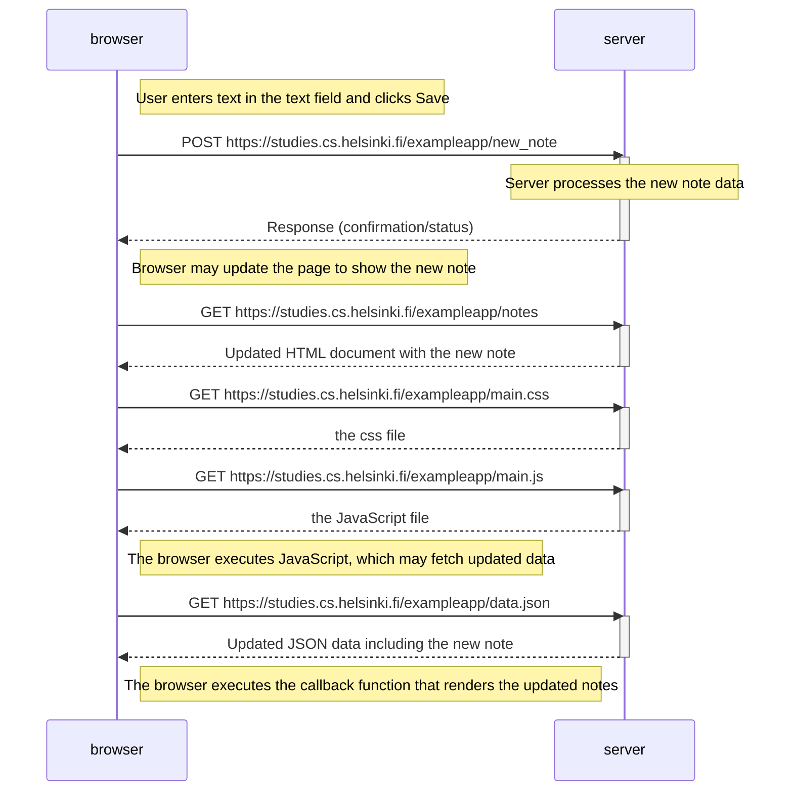

```mermaid
sequenceDiagram
    participant browser
    participant server

    Note right of browser: User enters text in the text field and clicks Save

    browser->>server: POST https://studies.cs.helsinki.fi/exampleapp/new_note
    activate server
    Note over server: Server processes the new note data
    server-->>browser: Response (confirmation/status)
    deactivate server

    Note right of browser: Browser may update the page to show the new note

    browser->>server: GET https://studies.cs.helsinki.fi/exampleapp/notes
    activate server
    server-->>browser: Updated HTML document with the new note
    deactivate server

    browser->>server: GET https://studies.cs.helsinki.fi/exampleapp/main.css
    activate server
    server-->>browser: the css file
    deactivate server

    browser->>server: GET https://studies.cs.helsinki.fi/exampleapp/main.js
    activate server
    server-->>browser: the JavaScript file
    deactivate server

    Note right of browser: The browser executes JavaScript, which may fetch updated data

    browser->>server: GET https://studies.cs.helsinki.fi/exampleapp/data.json
    activate server
    server-->>browser: Updated JSON data including the new note
    deactivate server

    Note right of browser: The browser executes the callback function that renders the updated notes

```

