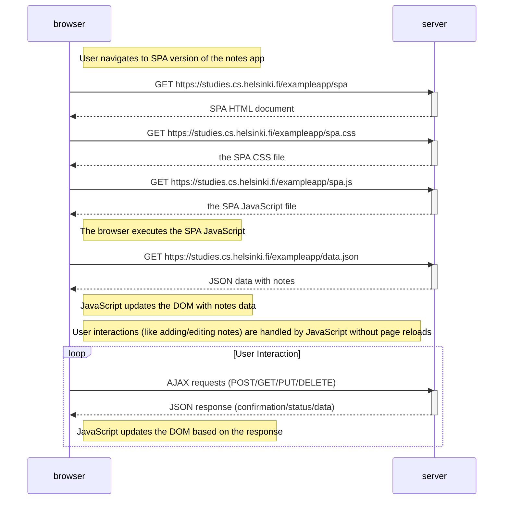

```mermaid
sequenceDiagram
    participant browser
    participant server

    Note right of browser: User navigates to SPA version of the notes app

    browser->>server: GET https://studies.cs.helsinki.fi/exampleapp/spa
    activate server
    server-->>browser: SPA HTML document
    deactivate server

    browser->>server: GET https://studies.cs.helsinki.fi/exampleapp/spa.css
    activate server
    server-->>browser: the SPA CSS file
    deactivate server

    browser->>server: GET https://studies.cs.helsinki.fi/exampleapp/spa.js
    activate server
    server-->>browser: the SPA JavaScript file
    deactivate server

    Note right of browser: The browser executes the SPA JavaScript

    browser->>server: GET https://studies.cs.helsinki.fi/exampleapp/data.json
    activate server
    server-->>browser: JSON data with notes
    deactivate server

    Note right of browser: JavaScript updates the DOM with notes data

    Note right of browser: User interactions (like adding/editing notes) are handled by JavaScript without page reloads

    loop User Interaction
        browser->>server: AJAX requests (POST/GET/PUT/DELETE)
        activate server
        server-->>browser: JSON response (confirmation/status/data)
        deactivate server

        Note right of browser: JavaScript updates the DOM based on the response
    end

```
