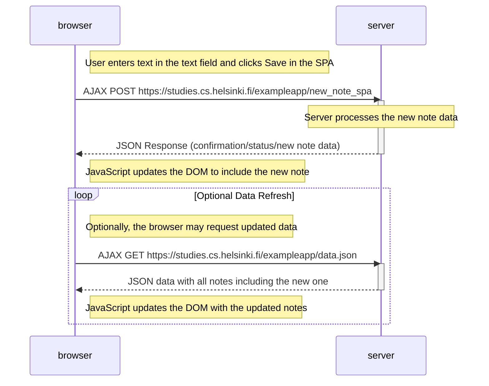

```mermaid
sequenceDiagram
    participant browser
    participant server

    Note right of browser: User enters text in the text field and clicks Save in the SPA

    browser->>server: AJAX POST https://studies.cs.helsinki.fi/exampleapp/new_note_spa
    activate server
    Note over server: Server processes the new note data
    server-->>browser: JSON Response (confirmation/status/new note data)
    deactivate server

    Note right of browser: JavaScript updates the DOM to include the new note

    loop Optional Data Refresh
        Note right of browser: Optionally, the browser may request updated data
        browser->>server: AJAX GET https://studies.cs.helsinki.fi/exampleapp/data.json
        activate server
        server-->>browser: JSON data with all notes including the new one
        deactivate server

        Note right of browser: JavaScript updates the DOM with the updated notes
    end

```
